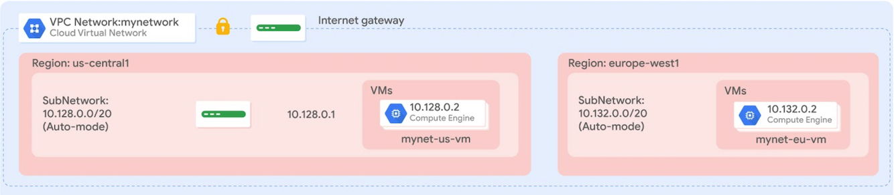

> :warning: **This lab content belongs to Google! Am publishing it here for reference purposes**: For up-to-date labs, please checkout  [Google Cloud Skills Boost Cloud Engineer Learning Path](https://www.cloudskillsboost.google/journeys)!

# Overview
Terraform enables you to safely and predictably create, change, and improve infrastructure. It is an open-source tool that codifies APIs into declarative configuration files that can be shared among team members, treated as code, edited, reviewed, and versioned.

In this lab, you create a Terraform configuration with a module to automate the deployment of Google Cloud infrastructure. Specifically, you deploy one auto mode network with a firewall rule and two VM instances, as shown in this diagram:  

  

## Objectives
In this lab, you learn how to perform the following tasks:

- Create a configuration for an auto mode network
- Create a configuration for a firewall rule
- Create a module for VM instances
- Create and deploy a configuration
- Verify the deployment of a configuration

## Setup
For each lab, you get a new Google Cloud project and set of resources for a fixed time at no cost.  

1. Sign in to Qwiklabs using an incognito window.

2. Note the lab's access time (for example, 1:15:00), and make sure you can finish within that time.
There is no pause feature. You can restart if needed, but you have to start at the beginning.

3. When ready, click Start lab.

4. Note your lab credentials (**Username** and **Password**). You will use them to sign in to the Google Cloud Console.

5. Click Open Google Console.

6. Click Use another account and copy/paste credentials for **this** lab into the prompts.
If you use other credentials, you'll receive errors or **incur** charges.

7. Accept the terms and skip the recovery resource page.

> **Note:** Do not click End Lab unless you have finished the lab or want to restart it. This clears your work and removes the project.

### Task 1. Set up Terraform and Cloud Shell
Configure your Cloud Shell environment to use Terraform.  

#### Install Terraform
Terraform is now integrated into Cloud Shell. Verify which version is installed.

1. In the Cloud Console, click **Activate Cloud Shell** icon.

2. If prompted, click **Continue**.

3. To confirm that Terraform is installed, run the following command: 

```bash
terraform --version
```  

The output should look like this:
```bash
Terraform v1.4.6
```
> **Note**: Don't worry if you get a warning that the version of Terraform is out of date, because the lab instructions will work with Terraform v1.3.3 and later. The available downloads for the latest version of Terraform are on the Terraform website. Terraform is distributed as a binary package for all supported platforms and architectures, and Cloud Shell uses Linux 64-bit.

4. To create a directory for your Terraform configuration, run the following command:

```bash
mkdir tfinfra
```
5. In Cloud Shell, click **Open editor** (Cloud Shell Editor icon).

> **Note**: If you see the message **"Unable to load code editor because third-party cookies are disabled"**, click **Open in New Window**. The code editor will open in a new tab. Return to the original tab, click Open Terminal and then switch back to the code editor tab. You will periodically need to switch back to the Cloud Shell terminal in this lab.  

6. In the left pane of the code editor, expand the tfinfra folder.

#### Initialize Terraform
Terraform uses a plugin-based architecture to support the numerous infrastructure and service providers available. Each **"provider"** is its own encapsulated binary distributed separately from Terraform itself. Initialize Terraform by setting **Google** as the provider.

1. To create a new file inside **tfinfra** folder, `right-click` on `tfinfra` folder and then click **New File**.

2. Name the new file `provider.tf`, and then open it.

3. Copy the code into `provider.tf`:
```bash
provider "google" {}
```
4. To save provider.tf, click **File** > **Save**.

5. To initialize Terraform, run the following command:  

```bash
cd tfinfra
terraform init
```  

The output should look like this:
```bash
* provider.google: version = "~> 4.43.0"
Terraform has been successfully initialized!
```

6. You are now ready to work with Terraform in Cloud Shell.

### Task 2. Create mynetwork and its resources
Create the `auto mode` network **mynetwork** along with its firewall rule and two VM instances (**mynet_us_vm** and **mynet_eu_vm**).

#### Configure mynetwork
Create a new configuration, and define mynetwork.

1. To create a new file inside **tfinfra**, right-click on `tfinfra` folder and then click **New File**.

2. Name the new file **mynetwork.tf**, and then open it.

3. Copy the following base code into mynetwork.tf:  
```bash
# Create the mynetwork network
resource [RESOURCE_TYPE] "mynetwork" {
name = [RESOURCE_NAME]
# RESOURCE properties go here
}
```  
This base template is a great starting point for any Google Cloud resource. The name field allows you to name the resource, and the type field allows you to specify the Google Cloud resource that you want to create. You can also define properties, but these are optional for some resources.

4. In **mynetwork.tf**, replace `[RESOURCE_TYPE]` with **"google_compute_network"** (with the quotes).
> **Note:** The google_compute_network resource is a VPC network. Available resources are in the Google Cloud provider documentation. Learn more about this specific resource in the Terraform documentation.

5. In mynetwork.tf, replace `[RESOURCE_NAME]` with **"mynetwork"** (with the quotes).

6. Add the following property to mynetwork.tf:
```bash
auto_create_subnetworks = "true"
```  
By definition, an auto mode network automatically creates a subnetwork in each region. Therefore, you are setting `auto_create_subnetworks` to true.

6. Verify that mynetwork.tf file look like this:  
```bash
# Create the mynetwork network
resource "google_compute_network" "mynetwork" {
name = "mynetwork"
# RESOURCE properties go here
auto_create_subnetworks = "true"
}
```  
7. To save mynetwork.tf, click **File** > **Save**.

#### Configure the firewall rule
Define a firewall rule to allow HTTP, SSH, RDP, and ICMP traffic on mynetwork.

1. Add the following base code to mynetwork.tf:  
```bash
# Add a firewall rule to allow HTTP, SSH, RDP and ICMP traffic on mynetwork
resource [RESOURCE_TYPE] "mynetwork-allow-http-ssh-rdp-icmp" {
name = [RESOURCE_NAME]
# RESOURCE properties go here
}
```
2. In **mynetwork.tf**, replace `[RESOURCE_TYPE]` with **"google_compute_firewall"** (with the quotes).
> **Note:** The google_compute_firewall resource is a firewall rule. Learn more about this specific resource in the Terraform documentation.

3. In mynetwork.tf, replace `[RESOURCE_NAME]` with **"mynetwork-allow-http-ssh-rdp-icmp"** (with the quotes).

4. Add the following property to mynetwork.tf:  
```bash
network = google_compute_network.mynetwork.self_link
```

> **Note:** Because this firewall rule depends on its network, you are using the google_compute_network.mynetwork.self_link reference to instruct Terraform to resolve these resources in a dependent order. In this case, the network is created before the firewall rule.

5. Add the following properties to mynetwork.tf:  
```bash
allow {
    protocol = "tcp"
    ports    = ["22", "80", "3389"]
    }
allow {
    protocol = "icmp"
    }
source_ranges = ["0.0.0.0/0"]
```  
The list of allow rules specifies which protocols and ports are permitted.

6. Verify that your mynetwork.tf file look like this:  
```bash
# Create the mynetwork network
resource "google_compute_network" "mynetwork" {
name = "mynetwork"
# RESOURCE properties go here
auto_create_subnetworks = "true"
}
# Add a firewall rule to allow HTTP, SSH, RDP and ICMP traffic on mynetwork
resource "google_compute_firewall" "mynetwork-allow-http-ssh-rdp-icmp" {
name = "mynetwork-allow-http-ssh-rdp-icmp"
# RESOURCE properties go here
network = google_compute_network.mynetwork.self_link
allow {
    protocol = "tcp"
    ports    = ["22", "80", "3389"]
    }
allow {
    protocol = "icmp"
    }
source_ranges = ["0.0.0.0/0"]
}
```  
7. To save mynetwork.tf, click **File** > **Save**.

#### Configure the VM instance
Define the VM instances by creating a VM instance module. A module is a reusable configuration inside a folder. You will use this module for both VM instances of this lab.

1. To create a new folder inside tfinfra, select the **tfinfra** folder, and then `click` **File** > **New Folder**.
2. Name the new folder **instance**.
3. To create a new file inside instance, `right-click` on **instance** folder and then `click` **New File**.
4. Name the new file **main.tf**, and then `open` it.
You should have the following folder structure in Cloud Shell:  
```bash
├── tfinfra
│   ├── instance
│   │   ├── main.tf
│   │   └── variables.tf
│   ├── mynetwork.tf
│   ├── provider.tf
```

5. Copy the following base code into main.tf:
```bash
resource [RESOURCE_TYPE] "vm_instance" {
  name = [RESOURCE_NAME]
  # RESOURCE properties go here
}
```

6. In **main.tf**, replace `[RESOURCE_TYPE]` with **"google_compute_instance"** (with the quotes).
> **Note:** The google_compute_instance resource is a Compute Engine instance. Learn more about this specific resource in the Terraform documentation.

7. In **main.tf**, replace `[RESOURCE_NAME]` with **"${var.instance_name}"** (with the quotes).
Because you will be using this module for both VM instances, you are defining the instance name as an input variable. This allows you to control the name of the variable from mynetwork.tf. Learn more about input variables in the **Terraform: Define Input Variables Guide.**  

8. Add the following properties to main.tf:  
```bash
  zone         = "${var.instance_zone}"
  machine_type = "${var.instance_type}"
```

These properties define the `zone` and `machine type` of the instance as **input variables**.

9. Add the following properties to main.tf:
```bash
  boot_disk {
    initialize_params {
      image = "debian-cloud/debian-11"
      }
  }
```
This property defines the boot disk to use the `Debian 11 OS image`. Because both VM instances will use the same image, you can hard-code this property in the module.

10. Add the following properties to **main.tf**:
```bash
  network_interface {
    network = "${var.instance_network}"
    access_config {
      # Allocate a one-to-one NAT IP to the instance
    }
  }
```
This property defines the network interface by providing the network name as an input variable and the access configuration. Leaving the access configuration empty results in an `ephemeral external IP address` (required in this lab). To create instances with only an internal IP address, remove the **access_config** section. For more information, see the Terraform documentation.  

11. Verify that main.tf looks like this, including brackets `{}`
```bash
resource "google_compute_instance" "vm_instance" {
  name         = "${var.instance_name}"
  zone         = "${var.instance_zone}"
  machine_type = "${var.instance_type}"
  boot_disk {
    initialize_params {
      image = "debian-cloud/debian-11"
      }
  }
  network_interface {
    network = "${var.instance_network}"
    access_config {
      # Allocate a one-to-one NAT IP to the instance
    }
  }
}
```  
12. To save `main.tf`, click **File** > **Save**.

13. To create a new file inside **instance**, `right-click` on instance folder and then click **New File**.

14. Name the new file **variables.tf**, and then open it.

15. Define the 4 input variables in variables.tf.
```bash
variable "instance_name" {}
variable "instance_zone" {}
variable "instance_type" {
  default = "e2-micro"
  }
variable "instance_network" {}
```  
By giving `instance_type` a default value, you make the variable optional. The `instance_name`, `instance_zone`, and `instance_network` are required, and you will define them in **mynetwork.tf**.

16. To save variables.tf, click **File** > **Save**.  
17. Add the following VM instances to **mynetwork.tf**:  
```bash
# Create the mynet-us-vm instance
module "mynet-us-vm" {
  source           = "./instance"
  instance_name    = "mynet-us-vm"
  instance_zone    = "us-east5-b"
  instance_network = google_compute_network.mynetwork.self_link
}
# Create the mynet-eu-vm" instance
module "mynet-eu-vm" {
  source           = "./instance"
  instance_name    = "mynet-eu-vm"
  instance_zone    = "europe-west1-d"
  instance_network = google_compute_network.mynetwork.self_link
}
```
These resources are leveraging the module in the instance folder and provide the name, zone, and network as inputs. Because these instances depend on a VPC network, you are using the google_compute_network.mynetwork.self_link reference to instruct Terraform to resolve these resources in a dependent order. In this case, the network is created before the instance.

> **Note:** The benefit of writing a Terraform module is that it can be reused across many configurations. Instead of writing your own module, you can also leverage existing modules from the Terraform Module registry.

18. To save **mynetwork.tf**, click **File** > **Save**.

19. Verify that **mynetwork.tf** looks like this, including brackets `{}`
```bash
# Create the mynetwork network
resource "google_compute_network" "mynetwork" {
name = "mynetwork"
# RESOURCE properties go here
auto_create_subnetworks = "true"
}
# Add a firewall rule to allow HTTP, SSH, RDP and ICMP traffic on mynetwork
resource "google_compute_firewall" "mynetwork-allow-http-ssh-rdp-icmp" {
name = "mynetwork-allow-http-ssh-rdp-icmp"
# RESOURCE properties go here
network = google_compute_network.mynetwork.self_link
allow {
    protocol = "tcp"
    ports    = ["22", "80", "3389"]
    }
allow {
    protocol = "icmp"
    }
source_ranges = ["0.0.0.0/0"]
}
# Create the mynet-us-vm instance
module "mynet-us-vm" {
  source           = "./instance"
  instance_name    = "mynet-us-vm"
  instance_zone    = "us-east5-b"
  instance_network = google_compute_network.mynetwork.self_link
}
# Create the mynet-eu-vm" instance
module "mynet-eu-vm" {
  source           = "./instance"
  instance_name    = "mynet-eu-vm"
  instance_zone    = "europe-west1-d"
  instance_network = google_compute_network.mynetwork.self_link
}
```  

#### Create mynetwork and its resources
It's time to apply the mynetwork configuration.

1. To rewrite the Terraform configuration files to a canonical format and style, run the following command:  
```bash
terraform fmt
```  
The output should look like this:  
```bash
mynetwork.tf
```
> **Note:** If you get an error, revisit the previous steps to ensure that your configuration matches the lab instructions. If you cannot troubleshoot the issue of your configuration, download and then look at these finished configurations:

- mynetwork.tf
- main.tf
- provider.tf
- variables.tf 
2. To initialize Terraform, run the following command:  
```bash
terraform init
```
The output should look like this:  
```bash
Initializing modules...
- mynet-eu-vm in instance
- mynet-us-vm in instance
...
* provider.google: version = "~> 4.43.0"
Terraform has been successfully initialized!
```
> **Note:** If you get an error, revisit the previous steps to ensure that you have the correct `folder/file` structure. If you cannot troubleshoot the issue of your configuration, refer to the finished configurations linked above. When you have corrected the issue, re-run the previous command.

3. To create an execution plan, run the following command:  
```bash
terraform plan
```
The output should look like this:  
```bash
...
Plan: 4 to add, 0 to change, 0 to destroy.
...
Terraform determined that the following 4 resources need to be added:

Name	Description
mynetwork	VPC network
mynetwork-allow-http-ssh-rdp-icmp	Firewall rule to allow HTTP, SSH, RDP and ICMP
mynet-us-vm	VM instance in us-east5-b
mynet-eu-vm	VM instance in "europe-west1-d"
To apply the desired changes, run the following command:

terraform apply
```  
4. To confirm the planned actions, type:  
```bash
yes
```
The output should look like this:  
```bash
...
Apply complete! Resources: 4 added, 0 changed, 0 destroyed.
```
### Task 3. Verify your deployment
In the Cloud Console, verify that the resources were created.

#### Verify your network in the Cloud Console
1. In the Cloud Console, on the Navigation menu (Navigation menu icon), click **VPC network** > **VPC networks**.

2. View the mynetwork VPC network with a subnetwork in every region.

3. On the Navigation menu, click **VPC network** > **Firewall**.

4. Sort the firewall rules by **Network**.

5. View the **mynetwork-allow-http-ssh-rdp-icmp** `firewall rule` for **mynetwork**.

6. Verify your VM instances in the `Cloud Console`
7. On the Navigation menu icon, click **Compute Engine** > **VM instances**. View the **mynet-us-vm** and **mynet-eu-vm** instances.

  Note the internal IP address for mynet-eu-vm.

8. For **mynet-us-vm**, click **SSH** to launch a terminal and connect.

9. To test connectivity to **mynet-eu-vm**'s `internal` IP address, run the following command in the `SSH` terminal `(replacing mynet-eu-vm's internal IP address with the value noted earlier)`:  
```bash
ping -c 3 <Enter mynet-eu-vm's internal IP here>
```
> **Note:** This should work because both VM instances are on the same network, and the firewall rule allows ICMP traffic!

### Task 4. Review
In this lab, you created a Terraform configuration with a module to automate the deployment of Google Cloud infrastructure. As your configuration changes, Terraform can create incremental execution plans, which allows you to build your overall configuration step by step.

The instance module allowed you to re-use the same resource configuration for multiple resources while providing properties as input variables. You can leverage the configuration and module that you created as a starting point for future deployments.

#### End your lab
When you have completed your lab, click End Lab. Google Cloud Skills Boost removes the resources you’ve used and cleans the account for you.